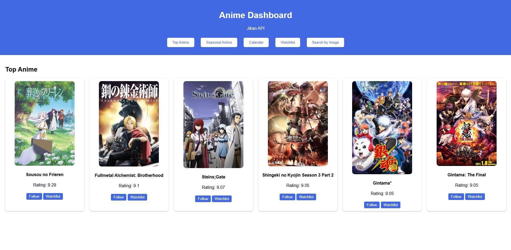

# MyAnimeList

A simple web application that uses the **Jikan API** and **trace.moe API** to explore anime, manage personal watchlist, and search anime by screenshot. Built with HTML, CSS, and JavaScript.

## Features
- **Top Anime** – Fetches top anime using the Jikan API.
- **Seasonal Anime** - Coming Soon
- **Calendar** - Coming Soon
- **Watchlist** – Add or remove anime titles, stored in user localStorage.
- **Search by Image** – Upload an image to find matching anime scenes using the Trace Moe API.
- Built with `async/await` and `axios` for API requests.
- Responsive UI with CSS grid and styled components.

## Screenshots

## Future Improvements
- Implement **Follow/Calendar** feature.
- Add seasonal anime section.
- Improve UI and many more.